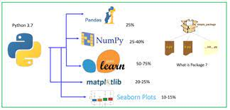
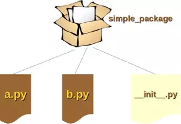
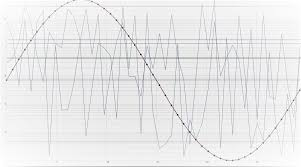
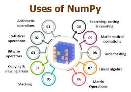
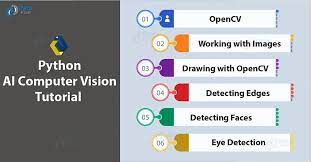
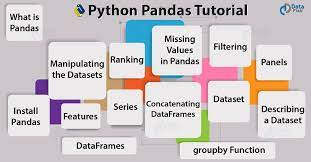

#packages:

 >Packages are a way of structuring Python’s module namespace by using “dotted module names”. For example, the module name A.B designates a submodule named B in a package named A. Just like the use of modules saves the authors of different modules from having to worry about each other’s global variable names, the use of dotted module names saves the authors of multi-module packages like NumPy or Pillow from having to worry about each other’s module names.
 

#pip in python:
)
it is used to install , uninstall and we can do many things with pip 
>format:python -m pip list [options]

###options:
>-o, --outdated
List outdated packages

>-u, --uptodate
List uptodate packages

>-e, --editable
List editable projects.

>-l, --local
If in a virtualenv that has global access, do not list globally-installed packages.

>--user
Only output packages installed in user-site.

>--path <path>
Restrict to the specified installation path for listing packages (can be used multiple times).

>--pre
Include pre-release and development versions. By default, pip only finds stable versions.

>--format <list_format>
Select the output format among: columns (default), freeze, or json

>--not-required
List packages that are not dependencies of installed packages.

>--exclude-editable
Exclude editable package from output.

>--include-editable
Include editable package from output.

>--exclude <package>
Exclude specified package from the output

####Users of the package can import individual modules from the package.

##there are some of the examples of  packages 
###for printing fibanocci series

> import fibo
>fib = fibo.fib
>fib(500)
>0 1 1 2 3 5 8 13 21 34 55 89 144 233 377

Users of the package can import individual modules from the package, for example:

###for sound

>import sound.effects.echo
>sound.effects.echo.echofilter(input, output, delay=0.7, atten=4)

###for arrays:

>import numpy as np
a = np.arange(15).reshape(3, 5)
print(a)

###for images and videos AI

>import cv2  
cv2.imread('dog.jpg',1)  
cv2.imshow('image',img)  
cv2.waitKey()    
cv2.destroyAllWindows() 

###for tables statistics

>pandas.DataFrame( data, index, columns, dtype, copy)